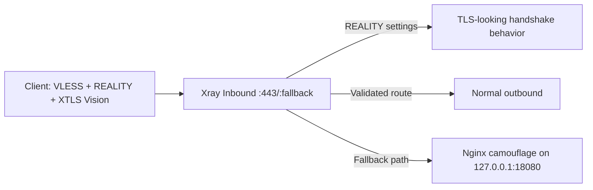
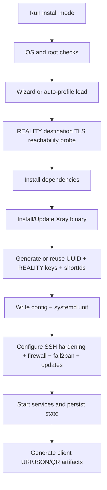

# VLESS + REALITY + XTLS Vision Bootstrap Installer

Production-oriented, single-file Bash bootstrap for `Xray-core` with `VLESS + REALITY + XTLS Vision`, focused on:

- fast first deployment,
- repeatable operations,
- built-in hardening choices,
- and reliable behavior in restrictive network conditions.

> [!IMPORTANT]
> This README is beginner-first. If this is your first Xray deployment, follow sections in order from **Quick Start** through **Post-Install Validation**.

> [!WARNING]
> Use only where you are authorized. Network transport tooling may be regulated in your country or organization. You are responsible for lawful and ethical use.

---

## Table of Contents

- [At a Glance](#at-a-glance)
- [30-Second Quick Start](#30-second-quick-start)
- [Before You Run](#before-you-run)
- [Why This Works Well Against DPI (Technical)](#why-this-works-well-against-dpi-technical)
- [How Installation Works](#how-installation-works)
- [Install Modes](#install-modes)
- [Wizard Prompt Reference](#wizard-prompt-reference)
- [Post-Install Validation](#post-install-validation)
- [Command Reference](#command-reference)
- [Generated Client Artifacts](#generated-client-artifacts)
- [Day-2 Operations Cookbook](#day-2-operations-cookbook)
- [Troubleshooting Matrix](#troubleshooting-matrix)
- [Backup and Rollback](#backup-and-rollback)
- [Security Model and Hardening Notes](#security-model-and-hardening-notes)
- [Glossary](#glossary)
- [FAQ](#faq)
- [License](#license)

---

## At a Glance

| If you want to... | Start here |
|---|---|
| Get online quickly | [30-Second Quick Start](#30-second-quick-start) |
| Understand DPI resilience mechanics | [Why This Works Well Against DPI (Technical)](#why-this-works-well-against-dpi-technical) |
| Run fully automated install | [Install Modes](#install-modes) |
| Verify if everything is healthy | [Post-Install Validation](#post-install-validation) |
| Fix failed connections | [Troubleshooting Matrix](#troubleshooting-matrix) |

Supported script modes:

```bash
install | update | repair | status | diagnose | reprint | rotate-shortid | uninstall
```

---

## 30-Second Quick Start

```bash
# 1) Clone on your VPS
cd /root
git clone https://github.com/braydos-h/vless-xtls-vision-installer.git
cd vless-xtls-vision-installer

# 2) Run interactive install
sudo bash xray_reality_bootstrap.sh install
```

After first install, use the persisted helper:

```bash
sudo /usr/local/sbin/xray-reality-bootstrap status
```

> [!TIP]
> If the wizard asks about SSH hardening, keep a second SSH session open until you confirm new settings work.

---

## Before You Run

### Preflight Checklist

- [ ] Fresh VPS or host where system-level firewall/SSH changes are acceptable
- [ ] Root access (`sudo` works)
- [ ] Supported OS: Debian 12, Ubuntu 22.04, or Ubuntu 24.04
- [ ] Domain you control with DNS `A`/`AAAA` record pointing to this server
- [ ] Outbound internet from VPS (for package install, Xray download, TLS probe)
- [ ] Port plan decided (`443` recommended primary)

### Requirements and Defaults

| Item | Value |
|---|---|
| Supported OS | Debian 12, Ubuntu 22.04, Ubuntu 24.04 |
| Service manager | `systemd` |
| Script file | `xray_reality_bootstrap.sh` |
| Persisted helper path | `/usr/local/sbin/xray-reality-bootstrap` |
| Xray config path | `/etc/xray/config.json` |
| State path | `/etc/xray/bootstrap-state.env` |
| Options profile path | `/etc/xray/bootstrap-options.json` |
| Client export directory | `/root/xray-client-configs` |
| Default primary port | `443` |
| Default update policy | `weekly` |
| Default logging profile | `minimal` |

---

## Why This Works Well Against DPI (Technical)

This section is intentionally technical, but still operationally practical.

### 1) REALITY handshake camouflage

The server is configured with a `serverName` and `dest` target. During connection establishment, traffic characteristics are shaped to align with legitimate TLS destinations, reducing obvious protocol signatures.

### 2) uTLS client fingerprinting

Generated client configs use `fingerprint: chrome`, which helps present common browser-like TLS behavior rather than uncommon custom stacks.

### 3) XTLS Vision flow efficiency

`flow=xtls-rprx-vision` reduces unnecessary overhead and helps maintain stable performance under constrained paths where noisy or inefficient tunnels degrade quickly.

### 4) ShortId controls and rotation

The server can accept multiple REALITY `shortIds`; the script can rotate them (`rotate-shortid`) without replacing UUID/keypair. This supports ongoing hygiene when a profile needs to be cycled.

### 5) Controlled fallback behavior

A local Nginx camouflage service is bound on loopback (default `127.0.0.1:18080`) and used as fallback destination handling. This helps avoid obvious dead-end behavior on non-matching flows.

### Connection Model



### What this does not guarantee

- It does not guarantee universal bypass on every network.
- It does not prevent endpoint/device compromise.
- It does not remove the need for good OPSEC and credential handling.
- It does not make illegal use acceptable.

---

## How Installation Works



---

## Install Modes

### Interactive (recommended for first run)

```bash
sudo bash xray_reality_bootstrap.sh install
```

### Auto-profile mode

```bash
sudo bash xray_reality_bootstrap.sh install --auto --non-interactive
```

### Custom profile path

```bash
sudo bash xray_reality_bootstrap.sh install --auto --non-interactive --profile-json /path/to/profile.json
```

### Non-interactive rules

- `install --non-interactive` requires `--auto`.
- If default profile is missing, the script can materialize an embedded template.
- Existing deployment detection menu is interactive by design unless running with explicit mode flags.

<details>
<summary>Example auto-profile JSON template</summary>

```json
{
  "profile_format": "1",
  "SERVER_NAME": "www.cloudflare.com",
  "DEST_ENDPOINT": "www.cloudflare.com:443",
  "LISTEN_PORT": "443",
  "FALLBACK_PORT": "",
  "FIREWALL_STYLE": "nftables",
  "SSH_PORT": "22",
  "CHANGE_SSH_PORT": "no",
  "HAS_SSH_KEYS": "yes",
  "DISABLE_PASSWORD_AUTH": "yes",
  "FAIL2BAN_ENABLED": "yes",
  "UNATTENDED_UPGRADES_ENABLED": "yes",
  "XRAY_UPDATE_POLICY": "weekly",
  "LOG_PROFILE": "minimal",
  "PROFILE_NAME": "reality-main",
  "SHORT_ID_LABEL": "main",
  "SHORT_ID_COUNT": "3",
  "BLOCK_PRIVATE_OUTBOUND": "yes",
  "CAMOUFLAGE_WEB_PORT": "18080"
}
```

</details>

---

## Wizard Prompt Reference

| Step | What you choose | Default | Why it matters | Beginner-safe choice |
|---|---|---|---|---|
| 1 | `serverName` + `DEST_ENDPOINT` | `www.cloudflare.com` + `:443` | Defines REALITY impersonation target and TLS probe behavior | Use a stable high-traffic TLS site and keep port `443` |
| 2 | Primary + optional fallback port | `443`, fallback off | Controls reachability and surface area | Start with primary `443`, skip fallback initially |
| 3 | Firewall style | `nftables` | Host policy enforcement | Keep `nftables` unless your team standard is `ufw` |
| 4 | SSH hardening | keep `22`, key-based checks | Prevent lockout and improve admin security | Keep defaults unless you already validated key login |
| 5 | OS/Xray update policy | OS upgrades on, Xray `weekly` | Patch cadence and operational effort | Keep OS upgrades on + weekly Xray |
| 6 | Logging profile | `minimal` | Troubleshooting detail vs exposure/noise | Use `minimal`; switch to verbose only during debug |
| 7 | Client profile + shortIds + private egress block | shortIds `3`, block private egress on | Affects client artifacts and exposure controls | Keep 3 shortIds and block private egress |

---

## Post-Install Validation

Run this in order right after install:

```bash
sudo /usr/local/sbin/xray-reality-bootstrap status
sudo /usr/local/sbin/xray-reality-bootstrap diagnose
sudo /usr/local/bin/xray -test -config /etc/xray/config.json
sudo systemctl is-active xray
sudo curl -fsS http://127.0.0.1:18080/healthz
```

Expected signals:

| Check | Healthy signal |
|---|---|
| `systemctl is-active xray` | `active` |
| `xray -test -config ...` | no fatal parse/runtime errors |
| `curl .../healthz` | returns `ok` |
| `status` mode | Xray + Nginx active, expected listen ports visible |
| `diagnose` mode | no persistent config/firewall/service errors |

If any check fails, jump to [Troubleshooting Matrix](#troubleshooting-matrix).

---

## Command Reference

Use either:

- repo-local command: `sudo bash xray_reality_bootstrap.sh <mode>`
- persisted helper: `sudo /usr/local/sbin/xray-reality-bootstrap <mode>`

| Mode | What it does | Typical use |
|---|---|---|
| `install` | Full wizard install/reconfigure | First deployment or planned reconfiguration |
| `update` | Updates Xray binary, keeps config/keys | Routine upgrade |
| `repair` | Reapplies saved state and hardening | Drift correction |
| `status` | Service + ports + firewall summary | Fast health check |
| `diagnose` | Unified diagnostics dump | Incident triage |
| `reprint` | Regenerates client exports from saved state | Re-share configs safely |
| `rotate-shortid` | Rotates shortIds only | Credential hygiene |
| `uninstall` | Removes deployment components | Decommission |

---

## Generated Client Artifacts

All client outputs are written under:

```bash
/root/xray-client-configs
```

File naming pattern (where `<profile>` is sanitized profile name):

| File | Purpose |
|---|---|
| `<profile>-primary.uri.txt` | Primary `vless://` URI |
| `<profile>-fallback.uri.txt` | Fallback URI (if configured) |
| `<profile>-v2rayn-primary.json` | v2rayN JSON |
| `<profile>-v2rayng-primary.json` | v2rayNG JSON |
| `<profile>-sing-box-primary.json` | sing-box JSON |
| `<profile>-shadowrocket-streisand-singbox-primary.json` | Apple client compatible copy |
| `<profile>-shortids.txt` | All accepted shortIds |
| `<profile>-summary.txt` | Deployment summary |
| `<profile>-primary.uri.qr.txt` / `.png` | Primary QR (if `qrencode` available) |
| `<profile>-fallback.uri.qr.txt` / `.png` | Fallback QR (if fallback configured) |

> [!WARNING]
> These files contain credentials and metadata. Keep them private and avoid posting screenshots publicly.

---

## Day-2 Operations Cookbook

### Weekly maintenance

```bash
sudo /usr/local/sbin/xray-reality-bootstrap status
sudo /usr/local/sbin/xray-reality-bootstrap diagnose
```

### Safe binary update

```bash
sudo /usr/local/sbin/xray-reality-bootstrap update
```

### Reapply full saved posture

```bash
sudo /usr/local/sbin/xray-reality-bootstrap repair
```

### Re-export client configs

```bash
sudo /usr/local/sbin/xray-reality-bootstrap reprint
```

### Rotate shortIds (keep UUID + keypair)

```bash
sudo /usr/local/sbin/xray-reality-bootstrap rotate-shortid
```

---

## Troubleshooting Matrix

| Symptom | Most likely cause | Run this first | Typical fix |
|---|---|---|---|
| Client timeout on connect | DNS mismatch, blocked port, wrong dest | `sudo /usr/local/sbin/xray-reality-bootstrap diagnose` | Verify domain points to VPS IP; ensure port open in firewall; rerun install with correct `DEST_ENDPOINT` |
| Wizard fails on REALITY destination probe | Target endpoint unreachable or TLS mismatch | `getent hosts <dest-domain>` and probe section output | Use a reachable TLS 1.3-capable target and matching `serverName`/`dest` |
| `xray` service inactive | Config error or failed restart | `sudo journalctl -u xray -xe --no-pager` | Validate config with `xray -test`, then run `repair` |
| No QR files generated | `qrencode` missing/unavailable | `command -v qrencode` | Run `reprint`; script attempts to install `qrencode` |
| SSH lockout risk after hardening | Port/auth change without validated key login | Existing SSH session + `sshd` status | Keep second SSH session open; only disable password auth after key login verified |
| Update timer not running | Policy set to manual or timer disabled | `systemctl status xray-update.timer` | Re-run install/repair and choose `weekly` or `daily` policy |
| Clients fail after shortId rotation | Old client shortId still in use | `sudo /usr/local/sbin/xray-reality-bootstrap reprint` | Distribute newly exported configs to clients |
| `status` shows unexpected open ports | Legacy rules or manual drift | `sudo /usr/local/sbin/xray-reality-bootstrap status` | Normalize via `repair`, then verify firewall manager (`nftables` or `ufw`) |

<details>
<summary>Deep-dive diagnostic command bundle</summary>

```bash
sudo /usr/local/sbin/xray-reality-bootstrap diagnose
sudo journalctl -u xray -p err -n 120 --no-pager
sudo /usr/local/bin/xray -test -config /etc/xray/config.json
sudo ss -lntp
```

</details>

---

## Backup and Rollback

Before major changes (`install` reconfigure, `repair`, `update`), back up:

```bash
sudo tar czf /root/xray-backup-$(date +%F-%H%M).tgz /etc/xray /root/xray-client-configs /usr/local/sbin/xray-reality-bootstrap
```

Basic rollback approach:

1. Restore files from backup archive.
2. Re-run `repair` to reapply services/firewall/hardening from restored state.
3. Validate with the [Post-Install Validation](#post-install-validation) checklist.

---

## Security Model and Hardening Notes

- Firewall is enforced via `nftables` or `ufw`.
- SSH hardening choices are applied during install flow.
- Optional `fail2ban` and `unattended-upgrades` are integrated.
- Logging profile can be tuned between `minimal` and `verbose`.
- `rotate-shortid` helps refresh client identifiers without replacing full identity material.
- Uninstall intentionally leaves generic security packages in place.

Recommended operator habits:

1. Keep SSH keys tested in a second session before auth changes.
2. Restrict access to `/etc/xray` and `/root/xray-client-configs`.
3. Rotate shared client credentials periodically.
4. Run `diagnose` before manual edits.

---

## Glossary

| Term | Meaning in this project |
|---|---|
| `VLESS` | Lightweight proxy protocol used for client-server transport |
| `REALITY` | TLS-camouflage transport mode used by Xray |
| `XTLS Vision` | Flow mode (`xtls-rprx-vision`) used in generated configs |
| `serverName` | Domain value presented in REALITY/TLS behavior |
| `dest` (`DEST_ENDPOINT`) | Upstream destination target used for REALITY behavior |
| `shortId` | REALITY identifier; server can accept multiple values |
| `reprint` | Regenerates client outputs without rotating core secrets |
| `repair` | Reapplies saved state and hardening to correct drift |

---

## FAQ

<details>
<summary>Is this a panel?</summary>

No. It is a single Bash bootstrap focused on transparent single-node operations, not a multi-user management panel.

</details>

<details>
<summary>Can I run this on CentOS/RHEL/Alpine?</summary>

No. Current script checks only Debian 12, Ubuntu 22.04, and Ubuntu 24.04.

</details>

<details>
<summary>Can I install non-interactively?</summary>

Yes. Use `install --auto --non-interactive` and provide a valid options profile JSON.

</details>

<details>
<summary>Does this guarantee bypass on every network?</summary>

No. It improves resilience characteristics, but results vary by network controls, endpoint hygiene, and operational choices.

</details>

<details>
<summary>How do I safely share client configs?</summary>

Use `reprint`, share only necessary artifacts per user/device, and treat all exported files as secrets.

</details>

---

## License

MIT. See `LICENSE`.
